

  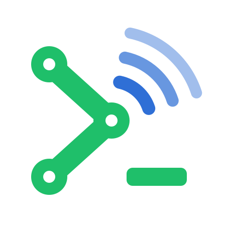

<h1 align="center">MC Term</h1>
<h3 align="center">M(esh)C(ore) Term(inal): a retro-style touch &amp; keyboard interface and WebUI for MeshCore LoRa devices. Off-grid messaging, maps and sensors. No phone and no internet needed.</h3>

  <a href="https://mcterm.net"><b>🌐 mcterm.net</b></a> ·
  <a href="https://github.com/dabeani/meshcoreterm/releases"><b>⬇️ Download</b></a> ·
  <a href="https://github.com/dabeani/meshcoreterm/wiki/UserGuide"><b>📖 User Guide</b></a> ·
  <a href="./CHANGELOG.md"><b>📝 Changelog</b></a> ·
  <a href="https://buymeacoffee.com/bmks"><b>☕ Support the project</b></a>

  

  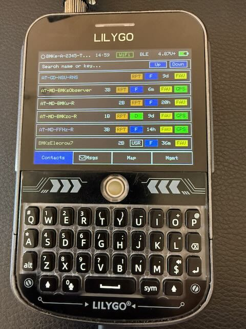

> **Important:** use at your own risk. You, the device owner, are responsible for any damage, data loss, or bricked devices.

## What is MC Term?

MC Term is a companion firmware for [MeshCore](https://github.com/ripplebiz/MeshCore), the lightweight hybrid-routing mesh for LoRa packet radios.
It turns the radio into a stand-alone communicator with its own screen: chat, see your mesh on a map, manage repeaters and read sensors.
When you want a bigger screen, open the **WebUI** in any browser, at `http://<devicename>.local`.
It also still works with the usual MeshCore apps (Android, iOS, web) over BLE or WiFi.

**Latest release: v0.9.14** (25.09.2026). See the [User Guide](https://github.com/dabeani/meshcoreterm/wiki/UserGuide) (quick start, glossary, every Mgmt page explained), the [changelog](./CHANGELOG.md) and the [releases page](https://github.com/dabeani/meshcoreterm/releases).

> ☕ **MC Term is a free hobby project.** If it is useful to you, please consider [buying me a coffee](https://buymeacoffee.com/bmks). Thank you very much!

## ✨ Highlights

| | |
|---|---|
| 🚨 **Pager alarm** | Send a secret phrase by direct message or in a channel and the receiving device sounds a siren (Wail, Police, Fire, Ambulance) with a blinking full-screen popup. Match modes: starts with, contains, ends with, exact, whole word. Filters for senders and channels. |
| 🗺️ **Automatic map downloader** | Pan the map and missing tiles download over WiFi, appear immediately, and are saved for offline use (SD card where the board has one, old tiles are removed when it fills up). Five tile sources or your own HTTPS tile server. |
| 💬 **Smart channel replies** | A reply to a channel message keeps the **region scope of the message you answer**, so it reaches the same audience. A tag shows the scope before you send. |
| 😀 **Emoji (limited support)** | Emoji in names and messages show as small colour pictures instead of `?`. An EMO page on the on-screen keyboard offers the 40 most used. |
| 📡 **Airview (BETA, spectrum analyzer)** | Mgmt → Stats → Airview: a live waterfall of the signal level on your channel, with noise floor and sensitivity lines, and every packet you hear colour-coded by type (advert, channel, DM, ack…). Built-in `?` help. |
| 🌡️ **Mgmt → Sensors** *(formerly Tele)* | Live graphs for every sensor and **calibration offsets** per reading. Corrected values are also sent as telemetry. Supports the MeshCore I²C sensor set plus chip temperatures. |
| 🔑 **Multiple identities** | Keep several node identities on the device (4 on internal storage, 8 on SD) and switch, create or copy them from the screen or the WebUI. |
| 🌐 **WebUI improvements** | More reliable and faster sync, phone and tablet friendly layout, live GPS page, Alarm and Sensors pages, map tile source picker, firmware upload with progress, hardened login. |
| 🏷️ **mDNS** | Reach the WebUI at `http://devicename.local` instead of an IP address. *(Not available on the T-Display P4 with the C6 AT WiFi backend.)* |

More: contacts, channels, DMs and room servers with delivery status, message path on the map, quick send/replies, remote repeater and room-server administration, lock screen with picture/channel/sensor background, quiet hours, dark and light theme, UI zoom, Bluetooth and WiFi (AP or Station).

## 🖥️ Companion Firmware: On-device GUI &amp; WebUI

The Companion firmware is what you flash for everyday use. Besides working with the standard MeshCore phone apps over BLE or WiFi, it gives you:

- **On-device GUI**: Contacts, Channels, Map and Management (an overview grid plus dedicated settings pages), operated by touch or the T-Deck keyboard and trackball.
- **WebUI**: a live mirror of the device in any browser over WiFi, once enabled in Management. Open `http://<devicename>.local` and sign in with the device's 6-digit PIN.

**Path hash and device identity**

- **Mgmt → Advert → Path Hash Mode**: choose 1-, 2- or 3-byte path hashes on the mesh (how much of each node's public key is used in routing).
- **Mgmt → Global → Device ID**: your hash prefix at the same width (for example `AB`, `ABCD`, `ABCDEF`).
- **Map markers**: `[hash]` badges on remote nodes use each peer's advert or route metadata.

**Map route overlay**

- Open a message's route from its detail view (device) or **Show Path On Map** (WebUI) to draw the hops on the map.
- While a path is focused, only the nodes on that path stay visible.

Full walkthrough: **[User Guide](https://github.com/dabeani/meshcoreterm/wiki/UserGuide)**.

## 📸 Screenshots

The screenshots show the **WebUI on a phone**, reached at `http://<devicename>.local`. The on-device screen has the same four tabs.

<table>
  <tr>
    <td align="center">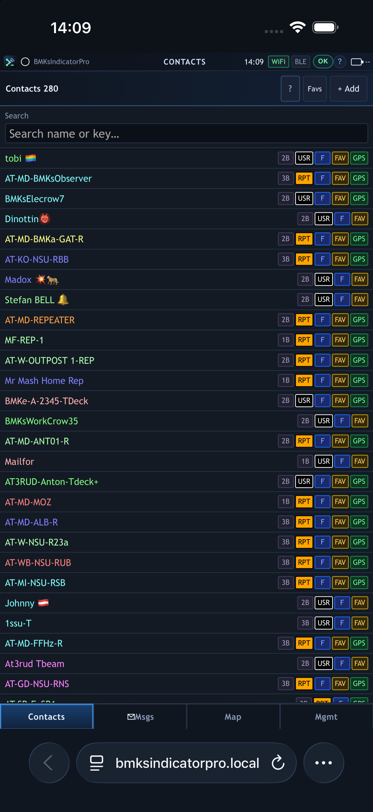 Contacts</td>
    <td align="center">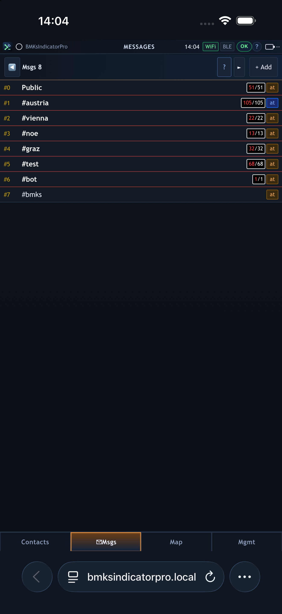 Channels (with region scope badges)</td>
    <td align="center">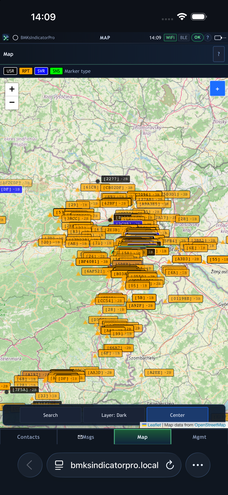 Map with OpenStreetMap tiles</td>
  </tr>
  <tr>
    <td align="center">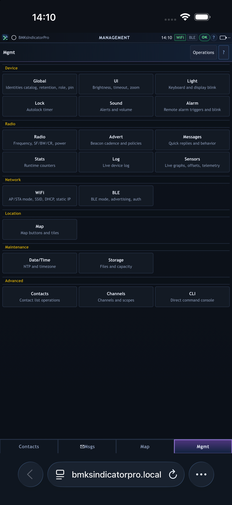 Management</td>
    <td align="center">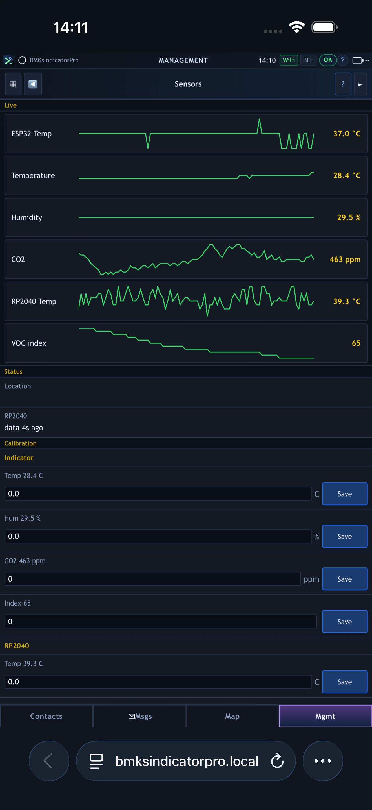 Sensors: live graphs and calibration</td>
    <td align="center">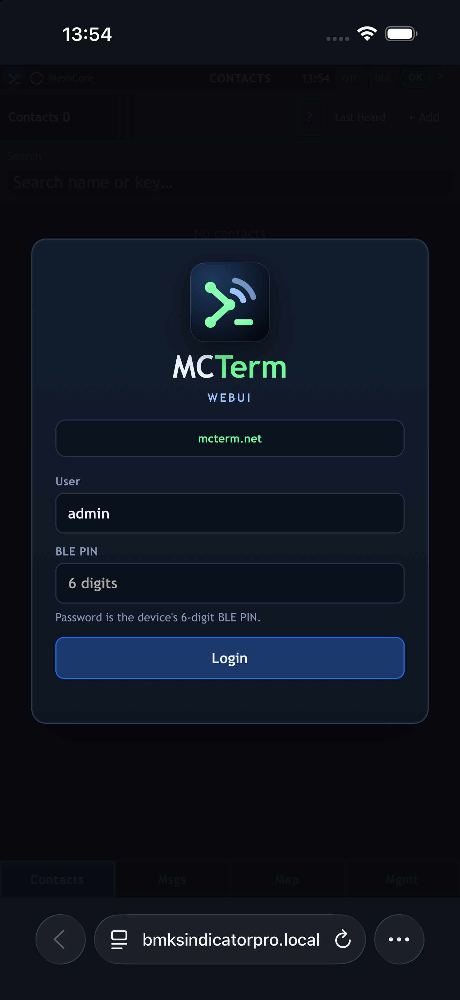 WebUI login</td>
  </tr>
</table>

## 📟 Supported devices

<table>
  <tr>
    <td align="center"> <a href="https://lilygo.cc/en-us/products/t-deck-plus-1">LilyGO T-Deck Plus</a> / T-Deck</td>
    <td align="center">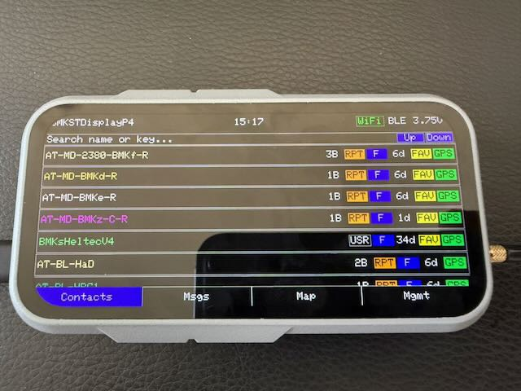 LilyGO T-Display P4 <i>(preview)</i></td>
    <td align="center">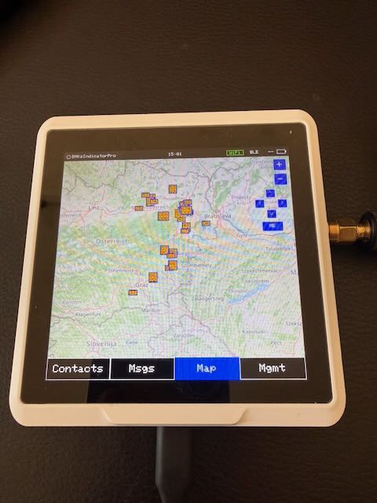 Seeed SenseCAP Indicator</td>
  </tr>
  <tr>
    <td align="center">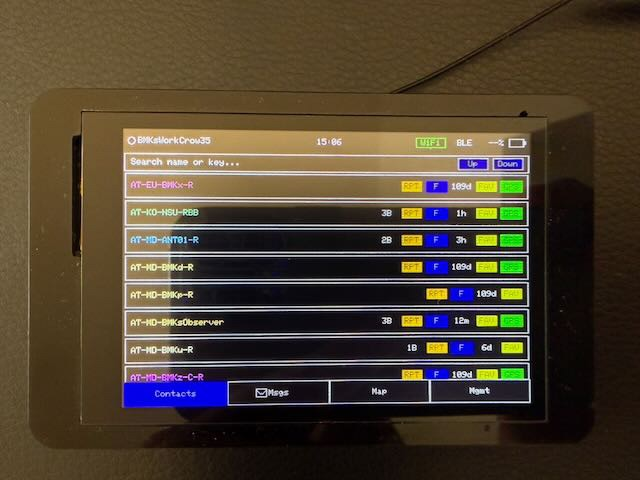 <a href="https://www.elecrow.com/pub/wiki/CrowPanel_Advance_3.5-HMI_ESP32_AI_Display.html">Elecrow CrowPanel 3.5″</a></td>
    <td align="center">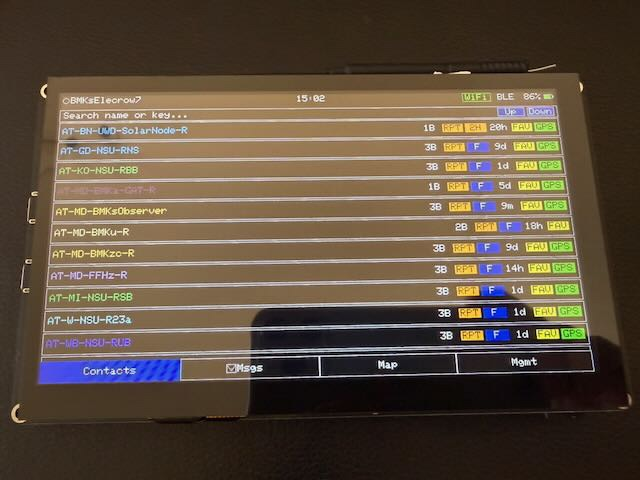 <a href="https://www.elecrow.com/crowpanel-advanced-7inch-esp32-p4-hmi-ai-display-1024x600-ips-touch-screen-with-wifi-6-compatible-with-arduino-lvgl-micropython.html">Elecrow CrowPanel 7″</a></td>
    <td align="center">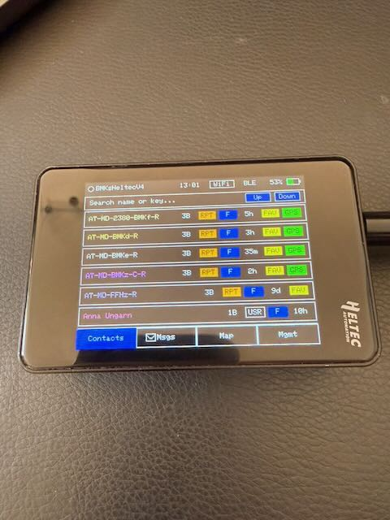 Heltec V4 with display</td>
  </tr>
</table>

The T-Display P4 firmware is not yet on a solid release candidate. It is shared so you can try the current state.

## 🚀 Installation

1. Download the file for your device from the [releases page](https://github.com/dabeani/meshcoreterm/releases). Check the file name:

   | File | Device |
   |------|--------|
   | `firmware_tdeckplus_v…` | LilyGO T-Deck Plus |
   | `firmware_indicatorpro_v…` | Seeed SenseCAP Indicator |
   | `firmware_elecrow35_v…` | Elecrow CrowPanel 3.5″ |
   | `firmware_elecrow7_v…` | Elecrow CrowPanel 7″ |
   | `firmware_heltecv4_v…` | Heltec V4 with display |
   | `firmware_tdisplayp4_v…` | LilyGO T-Display P4 |

2. Open <https://flasher.meshcore.io/> and choose **Custom Firmware**.
3. **First installation:** use the `…-merged.bin` file and do a **full flash erase** (this removes all settings).
   **Updating an existing install:** use the file **without** `-merged`; no erase needed, settings are kept.
4. Flash, then wait: the first boot can take 1–2 minutes and the screen may flicker. That is normal.
5. New to MeshCore? Follow the **Quick Start** in the [User Guide](https://github.com/dabeani/meshcoreterm/wiki/UserGuide).

> **SenseCAP Indicator:** it has two chips. Also install the matching `rp2040_indicator_v….uf2` from the same release (drag and drop onto the RP2040 drive). An old RP2040 image can break SD storage, map tiles, sensors and the buzzer.
>
> **Antenna first:** never power a LoRa device without its antenna attached.

## Default radio settings

Used when there are no saved settings (EU/UK):

- Frequency: 869.618 MHz
- Bandwidth: 62.5 kHz
- Spreading Factor: 8
- Coding Rate: 8
- TX Power: 22 dBm

Change them in **Mgmt → Radio** (see the [User Guide](https://github.com/dabeani/meshcoreterm/wiki/UserGuide#66-radio-configuration)). All devices that should talk to each other need identical Frequency, Bandwidth, SF and CR. Respect your country's rules for frequency, power and duty cycle.

## 🔍 About MeshCore

[MeshCore](https://github.com/ripplebiz/MeshCore) is a lightweight, decentralized mesh protocol for LoRa packet radios. Devices relay messages over multiple hops, with no internet, SIM card or central server. MC Term is built on top of it.

* **Multi-hop routing:** messages are flooded only while a route is unknown, then follow the learned direct path. You can set the maximum number of hops.
* **Companion nodes do not repeat messages**, so they cannot create bad routing paths. Range is extended with dedicated **Repeater** nodes.
* **Decentralized and resilient:** no central server, the network is self-healing.
* **Low power:** suitable for battery and solar operation.
* **Roles:** Companion (what you chat with), Repeater (relay), Room Server (shared posts), Sensor (telemetry).

**Good for:** off-grid communication, emergency response and disaster recovery, hiking and outdoor events, sensor networks.

## 📱 MeshCore Apps

The Companion firmware can be connected to with the usual MeshCore apps over BLE or WiFi:

- Web: <https://app.meshcore.nz>
- Android: <https://play.google.com/store/apps/details?id=com.liamcottle.meshcore.android>
- iOS: <https://apps.apple.com/us/app/meshcore/id6742354151?platform=iphone>
- NodeJS: <https://github.com/liamcottle/meshcore.js>
- Python: <https://github.com/fdlamotte/meshcore-cli>

Repeaters and Room Servers can be managed remotely over LoRa from the MeshCore app (Remote Management).

## Why "this" GUI?

MeshCore focuses on a compact, reliable mesh stack. MC Term adds a polished on-device interface and a WebUI, so small embedded radios are usable out of the box, without a phone. We like retro, you like retro, we stay retro. :-)

## Notes &amp; reliability

- Settings are stored on the device and survive reboots and updates.
- GPS: some variants (for example T-Deck Plus) need a specific UART baud rate (38400) and a good antenna position.
- Looking for offline map tiles? <https://github.com/mattdrum/map-tile-downloader>

## 📜 License &amp; third-party notes

See [license.txt](./license.txt). Map tiles come from OpenStreetMap at runtime; when you publish map screenshots, show "© OpenStreetMap contributors".

## ☕ Support MC Term &amp; bugs

  

Would be nice if you support me: **<https://buymeacoffee.com/bmks>**. Thank you very much!

Please [open an issue](https://github.com/dabeani/meshcoreterm/issues) for bug reports, improvements, enhancements or device support (harder when I don't own the device). Include your device, the firmware file name/version and, if possible, what you did before it happened. MeshCore community chat: [MeshCore Discord](https://discord.gg/BMwCtwHj5V).
